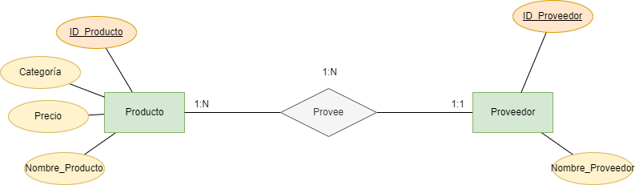
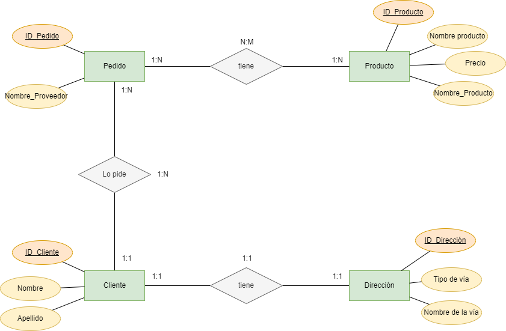
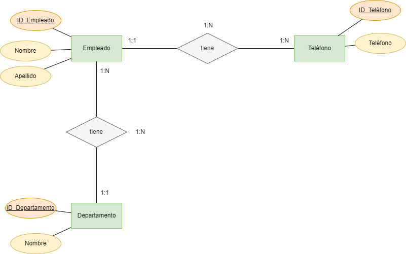
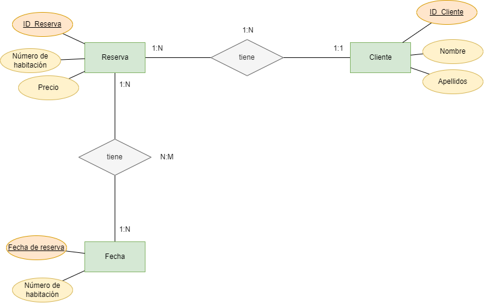
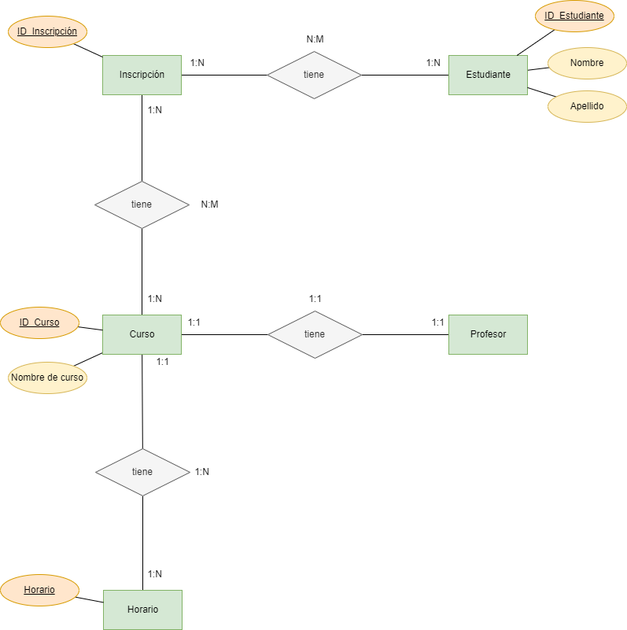
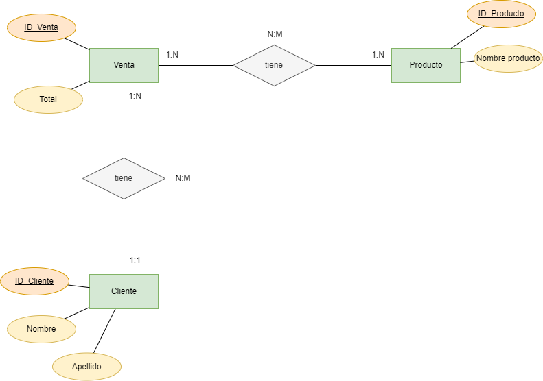
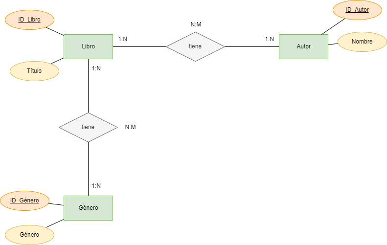
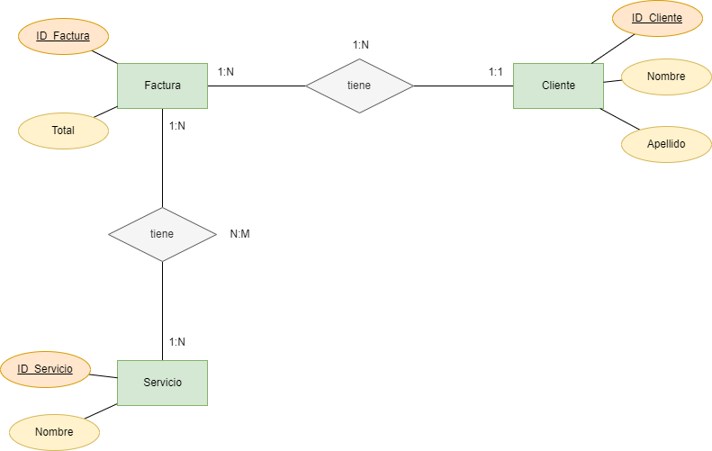
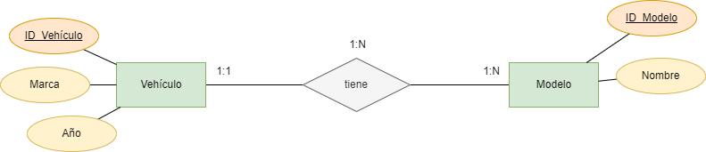
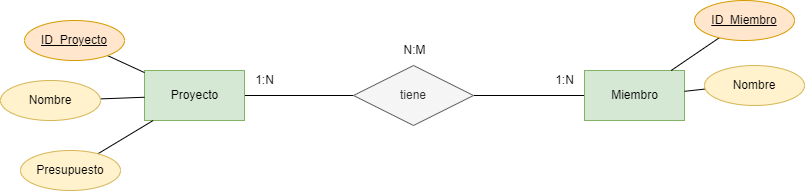

# Unidad 2/3 Tarea 6  (Ejercicios de Normalización de Bases de Datos (1FN y 2FN)

> [!IMPORTANT]
> Genera las claves necesarias para corregir las tablas resultantes.

## **Ejercicio 1: Lista de Productos**

### **Tabla Inicial: Productos**

| ID_Producto | Nombre_Producto | Proveedores      | Categoría   | Precio |
|------------|----------------|-----------------|------------|--------|
| 1          | Laptop         | Dell, HP        | Tecnología | 1000   |
| 2          | Mouse          | Logitech        | Accesorios | 25     |

1. Aplicar **1FN**, eliminando los valores multivaluados en "Proveedores".

2. Aplicar **2FN**, asegurando que cada campo dependa completamente de la clave primaria.

| ID_Producto | Nombre_Producto | Categoría   | Precio |
|-------------|-----------------|-------------|--------|
| 1           | Laptop          | Tecnología  | 1000   |
| 2           | Mouse           |  Accesorios | 25     |

| ID_Proveedor | Nombre_Proveedor |
|--------------|------------------|
|1             | Dell             |
|2             |HP                |
|3             | Logitech         |

| ID_Producto   | ID_Proveedor     |
|---------------|------------------|
|1              | 1                |
|1              | 2                |
|3              | 3                |

> Verifica generando el modelo Entidad/Relación

Modelo E/R

  
  

---------------

## **Ejercicio 2: Pedidos de Clientes**

### **Tabla Inicial: Pedidos**

| ID_Pedido | Cliente   | Dirección       | Producto     | Cantidad | Precio |
|----------|----------|---------------|-------------|----------|--------|
| 101      | Juan Pérez | Calle 123     | Laptop      | 1        | 1000   |
| 102      | Ana López | Av. Central   | Teclado     | 2        | 50     |

1. Aplicar **1FN**, separando valores repetidos y creando nuevas tablas si es necesario.
2. Aplicar **2FN**, asegurando que las dependencias parciales sean eliminadas.

No hay valores repetidos, por lo tanto separamos los valores compuestos.

| ID_Pedido | Nombre   | Apellido | Tipo de vía |Nombre de vía | Producto    | Cantidad | Precio |
|---------- |----------|----------|-------------|--------------|-------------|----------|--------|
| 101       | Juan     | Pérez    | Calle       |   123        | Laptop      | 1        | 1000   |
| 102       | Ana      |   López  | Avenida     | Central      | Teclado     | 2        | 50     |

Generamos las diferentes tablas para el modelo.

| ID_Pedido  | ID_Cliente  | ID_Producto  | Cantidad |
|----------- |-------------|--------------|----------|
| 101        | 1           | 1            | 1        |
| 102        | 2           | 2            | 2        |

|ID_Producto | Nombre Producto | Precio  |
|------------|-----------------|---------|
| 1          | Laptop          | 1000    |
| 2          | Teclado         | 50      |

| ID_Cliente | Nombre   | Apellido |
|----------- |----------|----------|
| 1          | Juan     | Pérez    |
| 2          | Ana      |   López  |

| ID_Cliente | ID_Dirección |
|------------|--------------|
| 1          | 1            |
| 2          | 2            |

| ID_Direccion | Tipo de vía | Nombre de la vía |
|--------------|-------------|------------------|
| 1            | Calle       | 123              |
| 2            | Avenida     | Central          |

> Verifica generando el modelo Entidad/Relación

Modelo E/R

  
  

---------------

## **Ejercicio 3: Registro de Empleados**

### **Tabla Inicial: Empleados**

| ID_Empleado | Nombre     | Teléfonos         | Departamento |
|------------|------------|------------------|--------------|
| 1          | Carlos R.  | 12345, 67890     | Ventas       |
| 2          | Laura M.   | 54321            | Finanzas     |

1. Aplicar **1FN**, eliminando los valores multivaluados en "Teléfonos".
2. Aplicar **2FN**, asegurando que cada atributo dependa completamente de la clave primaria.

| ID_Empleado | Nombre     | Apellido  |
|-------------|------------|-----------|
| 1           | Carlos     | R.        |
| 2           | Laura      | M.        |

|ID_Empleado | Teléfono |
|------------|----------|
|1           | 12345    |
|1           | 67890    |
|2           | 54321    |

|ID_Empleado | ID_Departamento |
|------------|-----------------|
|1           | 1               |
|2           | 2               |

|ID_Empleado | Departamento |
|------------|--------------|
|1           | Ventas       |
|2           | Finanzas     |

> Verifica generando el modelo Entidad/Relación

Modelo E/R

  
  

---------------

## **Ejercicio 4: Reservas de Hotel**

### **Tabla Inicial: Reservas**

| ID_Reserva | Cliente    | Habitación | Fechas              | Precio |
|------------|-----------|------------|---------------------|--------|
| 5001      | Pedro G.  | 101        | 01/02, 02/02, 03/02 | 300    |
| 5002      | María T.  | 202        | 10/03, 11/03       | 200    |

1. Aplicar **1FN**, eliminando los valores multivaluados en "Fechas".
2. Aplicar **2FN**, asegurando que las dependencias parciales sean eliminadas.

| ID_Reserva | ID_Cliente | Precio |
|------------|------------|--------|
| 5001       | 1          | 300    |
| 5002       | 2          | 200    |

| ID_Cliente | Nombre | Apellido |
|------------|--------|----------|
| 1          | Pedro  | G.       |
| 2          | María  | T.       |

|ID_Reserva | Fecha reserva | Número de habitación |
|-----------|---------------|----------------------|
| 5001      | 01/02         | 101                  |
| 5001      | 02/02         | 101                  |
| 5001      | 03/02         | 101                  |
| 5002      | 10/03         | 102                  |
| 5002      | 11/03         | 102                  |

> Verifica generando el modelo Entidad/Relación

Modelo E/R

  
  

---------------

## **Ejercicio 5: Inscripciones a Cursos**

### **Tabla Inicial: Inscripciones**

| ID_Inscripción | Estudiante | Curso        | Profesor    | Horarios |
|---------------|------------|--------------|------------|----------|
| 3001         | Luis R.    | Matemáticas  | Prof. Pérez | Lunes 10AM, Miércoles 2PM |
| 3002         | Ana S.     | Física       | Prof. Gómez | Martes 3PM |

1. Aplicar **1FN**, eliminando valores multivaluados en "Horarios".
2. Aplicar **2FN**, asegurando que cada campo dependa completamente de la clave primaria.

| ID_Inscripción | ID_Estudiante|
|----------------|--------------|
| 3001           | 1            |
| 3002           | 2            |

| ID_Inscripción | ID_Curso     |
|----------------|--------------|
| 3001           | 1            |
| 3002           | 2            |

| ID_Alumno    | Nombre   | Apellido |
|--------------|----------|----------|
| 1            | Luis     | Ramírez  |
| 2            | Ana      | Sánchez  |

| ID_Profesor    | Nombre   | Apellido |
|----------------|----------|----------|
| 1              | Juan     | Pérez    |
| 2              | Carlos   | Gómez    |

| ID_Profesor    | ID_Curso  |
|----------------|-----------|
| 1              | 1         |
| 2              | 2         |

| ID_Curso | Curso      |
|----------|------------|
| 1        | Matemáticas|
| 2        | Física     |

| ID_Curso | Horario        |
|----------|----------------|
| 1        | Lunes 10 am    |
| 1        | Miercoles 2 pm |
| 2        | Martes 3 pm    |

> Verifica generando el modelo Entidad/Relación

Modelo E/R

  
  

---------------

## **Ejercicio 6: Ventas de Tienda**

### **Tabla Inicial: Ventas**

| ID_Venta | Cliente    | Productos Comprados | Total |
|----------|------------|---------------------|-------|
| 8001     | Juan P.   | Celular, Funda      | 500   |
| 8002     | Andrea M. | Laptop              | 1000  |

1. Aplicar **1FN**, separando valores multivaluados en "Productos Comprados".
2. Aplicar **2FN**, asegurando que cada atributo dependa completamente de la clave primaria.

| ID_Venta | ID_Cliente    | Total  |
|----------|---------------|--------|
| 8001     | 1             | 500    |
| 8002     | 2             | 1000   |

| ID_Venta | ID_Producto   |
|----------|---------------|
| 8001     | 1             |
| 8001     | 2             |
| 8002     | 3             |

| ID_Cliente    | Nombre    | Apellido |
|---------------|-----------|----------|
| 1             | Juan      | P.       |
| 2             | Andrea    | M.       |

| ID_Producto | Nombre producto   |
|-------------|-------------------|
| 1           | Celular           |
| 2           | Funda             |
| 3           | Laptop            |

> Verifica generando el modelo Entidad/Relación

Modelo E/R

  
  

---------------

## **Ejercicio 7: Biblioteca de Libros**

### **Tabla Inicial: Libros**

| ID_Libro | Título | Autores          | Género  |
|----------|--------|-----------------|---------|
| 101      | El Quijote | Cervantes   | Novela  |
| 102      | 1984       | Orwell       | Ciencia Ficción |

1. Aplicar **1FN**, eliminando valores multivaluados en "Autores".
2. Aplicar **2FN**, asegurando que cada atributo dependa completamente de la clave primaria.

| ID_Libro | Título     |
|----------|------------|
| 101      | El Quijote |
| 102      | 1984       |

| ID_Libro | ID_Autor   |
|----------|------------|
| 101      | 1          |
| 102      | 2          |

| ID_Autor | Nombre autor |
|----------|--------------|
| 1        | Cervantes    |
| 2        | Orwell       |

| ID_Libro | ID_Género |
|----------|-----------|
| 101      | 1         |
| 102      | 2         |

| ID_Género | Género          |
|-----------|-----------------|
| 1         | Novela          |
| 2         | Ciencia Ficción |

> Verifica generando el modelo Entidad/Relación

Modelo E/R

  
  

---------------

## **Ejercicio 8: Facturación de Servicios**

### **Tabla Inicial: Facturas**

| ID_Factura | Cliente   | Servicios Contratados | Costo Total |
|------------|-----------|----------------------|-------------|
| 9001       | Juan P.   | Internet, TV        | 50          |
| 9002       | Ana M.    | Teléfono            | 20          |

1. Aplicar **1FN**, separando valores multivaluados en "Servicios Contratados".
2. Aplicar **2FN**, asegurando que cada atributo dependa completamente de la clave primaria.

| ID_Factura | ID_Cliente  | Costo Total |
|------------|-------------|-------------|
| 9001       | 1           | 50          |
| 9002       | 2           | 20          |

| ID_Cliente | Nombre  | Apellido |
|------------|---------|----------|
| 1          | Juan    | P.       |
| 2          | Ana     | M.       |

| ID_Servicio | Nombre   |
|-------------|----------|
| 1           | Internet |
| 2           | TV       |
| 3           | Teléfono |

| ID_Factura | ID_Servicio |
|------------|-------------|
| 9001       | 1           |
| 9001       | 2           |
| 9002       | 3           |

> Verifica generando el modelo Entidad/Relación

Modelo E/R

  
  

---------------

## **Ejercicio 9: Gestión de Vehículos**

### **Tabla Inicial: Vehículos**

| ID_Vehículo | Marca   | Modelos          | Año |
|------------|--------|----------------|-----|
| 5001       | Toyota  | Corolla, Yaris  | 2022 |
| 5002       | Honda   | Civic          | 2023 |

1. Aplicar **1FN**, eliminando valores multivaluados en "Modelos".
2. Aplicar **2FN**, asegurando que cada atributo dependa completamente de la clave primaria.

| ID_Vehículo | Marca   | Año  |
|-------------|---------|-------|
| 5001        | Toyota  | 2022  |
| 5002        | Honda   | 2023  |

| ID_Modelo | Nombre  |
|-----------|---------|
| 1234      | Corolla |
| 5678      | Yaris   |
| 9876      | Civic   |

| ID_Vehículo | ID_Modelo  |
|-------------|------------|
| 5001        | 1234       |
| 5001        | 5678       |
| 5002        | 9876       |

> Verifica generando el modelo Entidad/Relación

Modelo E/R

  
  

---------------

## **Ejercicio 10: Gestión de Proyectos**

### **Tabla Inicial: Proyectos**

| ID_Proyecto | Nombre       | Miembros        | Presupuesto |
|------------|-------------|----------------|------------|
| 7001       | Web App     | Juan, Ana      | 5000       |
| 7002       | E-commerce  | Pedro, María   | 10000      |

1. Aplicar **1FN**, eliminando valores multivaluados en "Miembros".
2. Aplicar **2FN**, asegurando que cada atributo dependa completamente de la clave primaria.

| ID_Proyecto | Nombre      | Presupuesto |
|-------------|-------------|-------------|
| 7001        | Web App     | 5000        |
| 7002        | E-commerce  | 10000       |

| ID_Proyecto | ID_Miembro  |
|-------------|-------------|
| 7001        | 1           |
| 7001        | 2           |
| 7002        | 3           |
| 7002        | 4           |

| ID_Miembro  | Nombre |
|-------------|--------|
| 1           | Juan   |
| 2           | Ana    |
| 3           | Pedro  |
| 4           | María  |

> Verifica generando el modelo Entidad/Relación

Modelo E/R

  
  

:tm: :shipit: :recycle: :goberserk:
 
